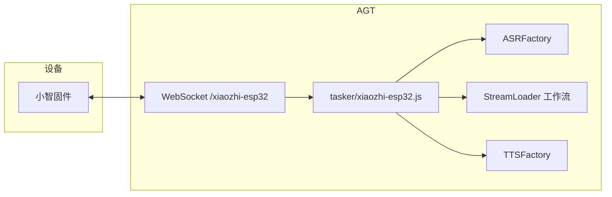
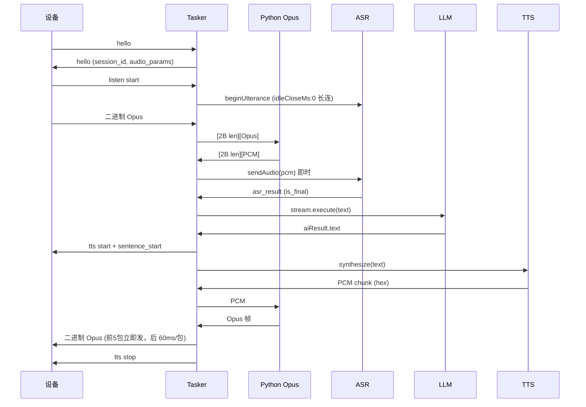

# xiaozhi-Core

> XRK-AGT 的 **xiaozhi-esp32** 对接模块，实现 [78/xiaozhi-esp32](https://github.com/78/xiaozhi-esp32) WebSocket 协议，小智固件直连即走 **ASR→LLM→TTS**，语音识别与合成零延迟、秒回应。

---

## 导航

| 小节 | 说明 |
|------|------|
| [连接](#连接) | WebSocket 路径、URL、请求头 |
| [协议要点](#协议要点) | hello / listen / Opus 流程 |
| [AGT 框架优势](#agt-框架优势) | 为何选 AGT、与官方 server 对比 |
| [架构与流程](#架构与流程) | Mermaid 架构图与时序图 |
| [目录](#目录) | 本 Core 文件与职责 |
| [使用](#使用) | 自测、Python 依赖 |
| [文档](#文档) | 协议与框架文档链接 |

---

## 连接

- **路径**：`/xiaozhi-esp32`（主）、`/xiaozhi/v1`（兼容官方）
- **URL**：`ws://<服务器>:<端口>/xiaozhi-esp32`
- **device-id**：请求头 `Device-Id` 或 URL query
- **请求头**：`Device-Id`、`Client-Id`、`Authorization: Bearer <token>`、`Protocol-Version`

---

## 协议要点

- **hello** → 服务端回 **hello**（`session_id`、`audio_params`）
- **listen**（`state: start/stop/detect`）+ 可选二进制 Opus
- **Opus**：由 Python (opuslib_next) 子进程编解码，Node 做管道与流控；支持 **abort**、**mcp**、**system**

---

## AGT 框架优势

在 AGT 上跑 xiaozhi-Core，相比单独部署官方 xiaozhi-esp32-server，具有以下优势：

| 维度 | AGT + xiaozhi-Core | 官方 xiaozhi-esp32-server |
|------|--------------------|---------------------------|
| **统一入口** | 与 `/device` 等同一进程、同一端口，一个配置管全部 | 需单独部署 Python/Java 服务 |
| **ASR/TTS/LLM 复用** | 共用 ASRFactory/TTSFactory、工作流（aistream），配置一处生效 | 自维护一套 ASR/TTS/LLM 集成 |
| **零延迟链路** | 语音→Opus 解码→PCM 即送 ASR；is_final 即触发 LLM→TTS，无多余缓冲与轮询延迟 | 依赖官方实现与部署环境 |
| **扩展性** | 事件 `xiaozhi.device.*` 入插件体系，可接更多设备/业务 | 需改官方代码或另写网关 |
| **运维** | 单进程、Node 为主，Python 仅 Opus 子进程，易监控与扩缩容 | 多语言、多进程部署复杂 |

---

## 架构与流程

### 在 AGT 中的位置

### 语音到回复的时序（零延迟链路）

---

## 目录

| 目录/文件 | 说明 |
|-----------|------|
| [tasker/xiaozhi-esp32.js](tasker/xiaozhi-esp32.js) | WebSocket Tasker，ASR/TTS/LLM 串联，暴露 `getConnectionCount()` / `getConnections()` |
| [stream/xiaozhi.js](stream/xiaozhi.js) | 工作流（音量、点歌等），见 [aistream](../../../docs/aistream.md) |
| [http/xiaozhi.js](http/xiaozhi.js) | HTTP：`/api/xiaozhi/config`、`/api/xiaozhi/status`，OTA `/xiaozhi/ota` |
| [events/xiaozhi.js](events/xiaozhi.js) | 事件 `xiaozhi.device.*` → `PluginsLoader.deal` |
| [commonconfig/xiaozhi.js](commonconfig/xiaozhi.js) | 配置 schema；配置文件为同目录下 `xiaozhi.yaml`（可由 index 生成默认） |
| [scripts/pcm_to_opus_stream.py](scripts/pcm_to_opus_stream.py) | TTS：PCM → Opus 流 |
| [scripts/opus_to_pcm_stream.py](scripts/opus_to_pcm_stream.py) | ASR：Opus → PCM 流 |
| [scripts/requirements.txt](scripts/requirements.txt) | Python：opuslib_next；Windows 可 `pip install PyOgg` |
| [scripts/test-xiaozhi-tasker.js](scripts/test-xiaozhi-tasker.js) | Tasker 自测 |

---

## 使用

- **自测**（项目根）：`node core/xiaozhi-Core/scripts/test-xiaozhi-tasker.js` 或 `cd core/xiaozhi-Core && pnpm run test:tasker`
- **Python 依赖**：`pip install -r core/xiaozhi-Core/scripts/requirements.txt`

---

## 文档

- 协议：[78/xiaozhi-esp32 WebSocket](https://github.com/78/xiaozhi-esp32/blob/main/docs/websocket.md)
- 框架：[tasker-base-spec](../../../docs/tasker-base-spec.md)、[aistream](../../../docs/aistream.md)、[plugin-base](../../../docs/plugin-base.md)